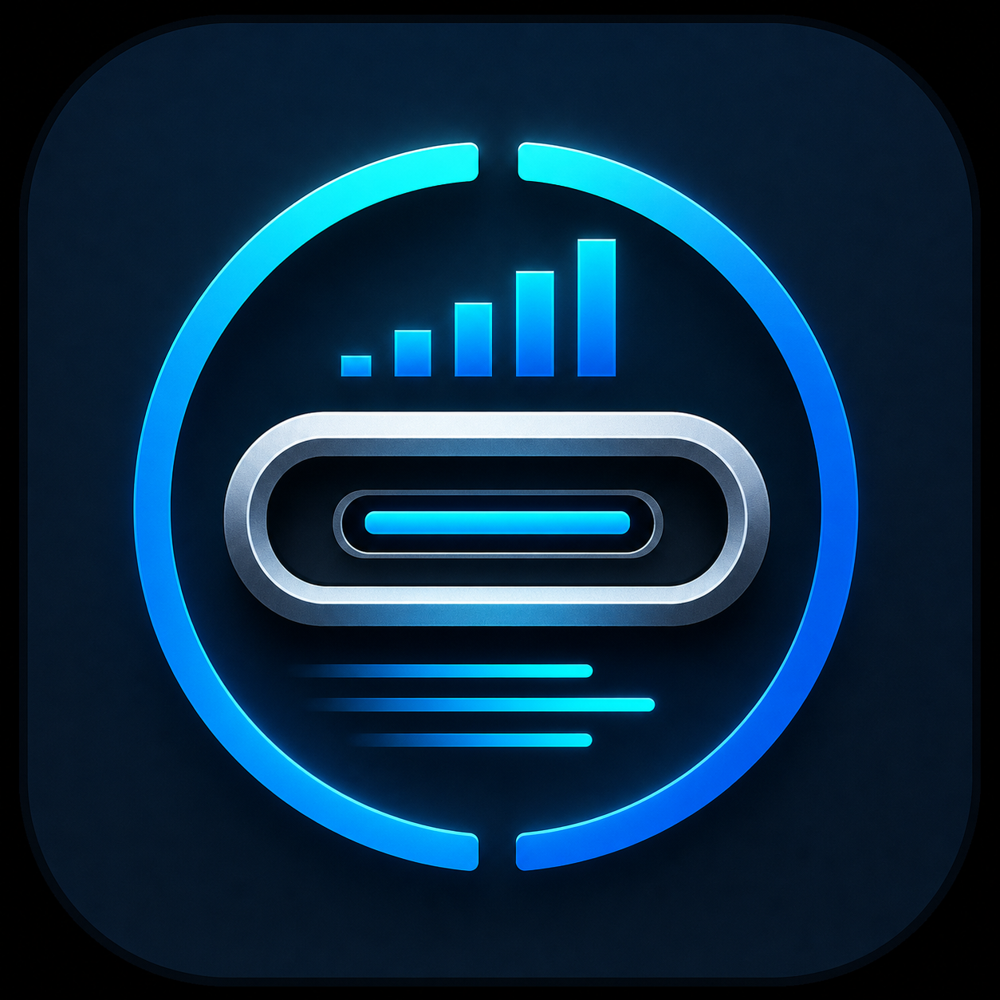
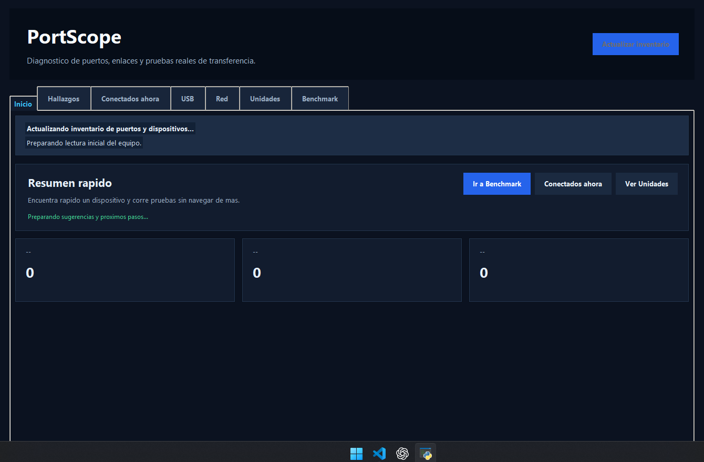
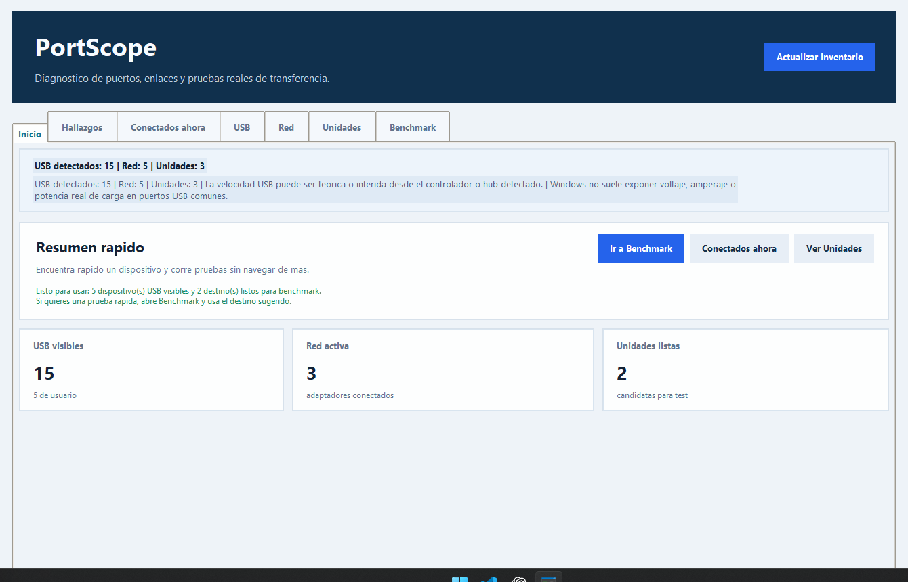
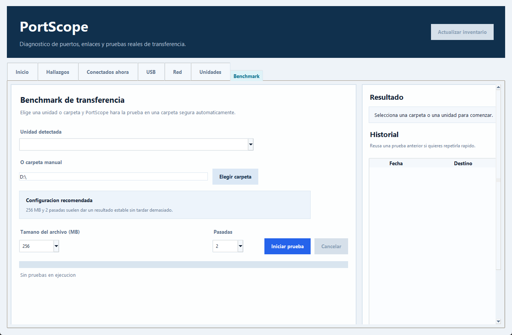
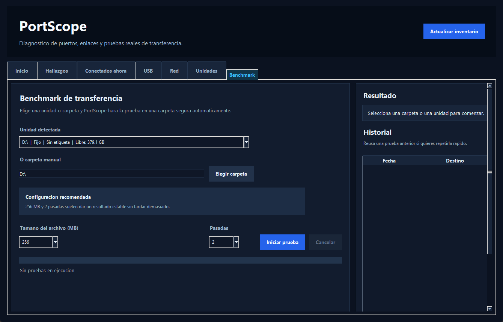

# PortScope

<p align="center">
  
</p>

<p align="center">
  Aplicacion de escritorio para Windows orientada a diagnosticar puertos, enlaces y rendimiento real de transferencia.
</p>

## Vista general

PortScope reune en una sola app:

- inventario USB, red y unidades
- deteccion de dispositivos conectados ahora mismo
- estado por modulo para detectar fallos parciales
- benchmark real de lectura y escritura
- historial persistente
- exportacion de inventario y resultados

## Capturas

### Inicio

**Modo claro**



**Modo oscuro**



### Benchmark

**Modo claro**



**Modo oscuro**



## Funcionalidades principales

### Inventario tecnico

- Detecta puertos y dispositivos USB visibles
- Muestra fabricantes, categoria, velocidad estimada y disponibilidad de energia
- Lista adaptadores de red, tipo de enlace y velocidad negociada
- Muestra unidades, salud, espacio libre y destinos listos para benchmark

### Estado del equipo

- Resume estado por modulo: `USB`, `Red` y `Unidades`
- Señala hallazgos utiles para actuar rapido
- Diferencia entre lectura correcta y fallo parcial de un modulo

### Benchmark de transferencia

- Ejecuta pruebas reales de lectura y escritura en la ruta elegida
- Usa carpeta temporal segura y la limpia al terminar
- Permite cancelar la prueba sin dejar rastro
- Guarda historial y permite reusar destinos anteriores

### Exportacion y trazabilidad

- Exporta historial de benchmark a CSV
- Exporta inventario completo a JSON
- Exporta inventario por secciones a un paquete CSV
- Guarda logs locales para revisar errores o ejecuciones

### Interfaz

- Modo claro y modo nocturno
- Pestañas por area de trabajo
- Scroll dinamico en areas largas
- Compatibilidad con rueda del mouse en Benchmark

## Limitaciones honestas

- Windows no expone de forma uniforme el voltaje y amperaje real de carga para todos los puertos USB
- La velocidad USB mostrada puede ser teorica o inferida segun lo que reporta el sistema
- Para potencia electrica real conviene complementar con hardware USB tester

## Requisitos

- Windows 10 u 11
- Python 3.11+ para ejecutar desde codigo
- No depende de librerias de runtime externas; usa Tkinter y utilidades del propio sistema

## Ejecutar desde codigo

```powershell
python .\app.py
```

## Crear el EXE de release

Instala dependencias de build:

```powershell
pip install -r .\requirements.txt
```

Genera el ejecutable y el ZIP de release:

```powershell
powershell -ExecutionPolicy Bypass -File .\scripts\build_release.ps1
```

Salida esperada:

- `release\PortScope-0.5.1-win64\PortScope.exe`
- `release\PortScope-0.5.1-win64.zip`

## Tests

```powershell
python -m unittest discover -s .\tests -v
```

## Estructura del proyecto

- `app.py`: entrada principal de la app
- `portscope/ui.py`: interfaz Tkinter y flujo principal
- `portscope/system_info.py`: lectura de USB, red, unidades y snapshot general
- `portscope/benchmark.py`: benchmark real de lectura y escritura
- `portscope/history.py`: historial y preferencias
- `portscope/logger.py`: logs locales
- `portscope/exporters.py`: exportacion de inventario
- `assets/portscope.ico`: icono del ejecutable y de la app
- `docs/screenshots/`: capturas usadas en la documentacion
- `scripts/build_release.ps1`: build del ejecutable
- `tests/`: pruebas automatizadas

## Logs y datos locales

PortScope guarda informacion local en:

- `C:\Users\<tu_usuario>\.portscope\history.json`
- `C:\Users\<tu_usuario>\.portscope\settings.json`
- `C:\Users\<tu_usuario>\.portscope\portscope.log`

## Licencia

Este proyecto se distribuye bajo la licencia MIT. Revisa [LICENSE](./LICENSE).
